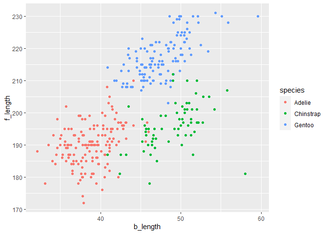

Homework 1
================

This is my solution to HW1.

``` r
library(tidyverse)
```

## Problem 1

Create a data frame with the specified elements.

``` r
pro1_df = 
  tibble(
    samp = rnorm(10),
    samp_gt_0 = samp > 0,
    char_vec = c("a", "b", "c", "d","e", "f", "g", "h", "i", "j" ),
    factor_vec = factor(c("low","low","low","mod","mod","mod","mod","high","high","high"))
)
```

Take the mean of each variable in my data frame.

``` r
mean(pull(pro1_df, samp))
```

    ## [1] 0.6087228

``` r
mean(pull(pro1_df, samp_gt_0))
```

    ## [1] 0.8

``` r
mean(pull(pro1_df, char_vec))
```

    ## Warning in mean.default(pull(pro1_df, char_vec)): argument is not numeric or
    ## logical: returning NA

    ## [1] NA

``` r
mean(pull(pro1_df, factor_vec))
```

    ## Warning in mean.default(pull(pro1_df, factor_vec)): argument is not numeric or
    ## logical: returning NA

    ## [1] NA

I can take the mean of number and logical but not character and factor

``` r
as.numeric(pull(pro1_df, samp_gt_0)) * pull(pro1_df, samp)
```

    ##  [1] 0.0000000 0.0000000 0.5249847 1.2084706 0.8376720 1.2422473 0.9967412
    ##  [8] 0.8398277 0.2045081 0.3882728

``` r
as.factor(pull(pro1_df, samp_gt_0)) * pull(pro1_df, samp)
```

    ## Warning in Ops.factor(as.factor(pull(pro1_df, samp_gt_0)), pull(pro1_df, : '*'
    ## not meaningful for factors

    ##  [1] NA NA NA NA NA NA NA NA NA NA

``` r
as.numeric(as.factor(pull(pro1_df, samp_gt_0))) * pull(pro1_df, samp)
```

    ##  [1] -0.151523878 -0.003972825  1.049969469  2.416941172  1.675344005
    ##  [6]  2.484494658  1.993482426  1.679655444  0.409016270  0.776545553

## Problem 2

``` r
data("penguins", package = "palmerpenguins")
```

Description of the dataset: The important variables are **species,
island, bill\_length\_mm, bill\_depth\_mm, flipper\_length\_mm,
body\_mass\_g, sex, year**. The dataset has **344** rows and **8**
columns. The mean flipper size is **200.9152047** mm.

Make a scatter plot of flip\_length vs. bill\_length from the penguins
dataset.

``` r
plot_df = tibble(
  b_length = pull(penguins,bill_length_mm),
  f_length = pull(penguins,flipper_length_mm),
  species = pull(penguins,species)
)

ggplot(plot_df, aes(x = b_length, y = f_length, color = species)) + geom_point()
```

    ## Warning: Removed 2 rows containing missing values (geom_point).

<!-- -->

``` r
ggsave("plot.pdf")
```

    ## Warning: Removed 2 rows containing missing values (geom_point).
